# DotaGraph context graph

This graph is a navigation aid. The Markdown memory files and living project docs remain the readable source.

```mermaid
flowchart TD
    Owner[Owner decisions] --> Product[DotaGraph product]
    Figma[Figma design] --> UX[Graph-first UX]
    Design[DESIGN.md] --> UX
    Agents[AGENTS.md] --> Rules[Project rules]

    Product --> Scope[Hero counters current scope]
    Product --> Audience[Ordinary ranked players]
    Product --> Language[English now]
    Product --> Future[Later explicit layers]

    Scope --> Semantics[A -> B = A counters B]
    Scope --> Rank[Ancient+ headline]
    Scope --> Patch[Current patch only]
    Scope --> Limit[0-5 each direction]
    Scope --> Sample[500 match planning threshold]

    Semantics --> Display[Source hero win rate]
    Display --> Labels[Source-side labels]
    Labels --> PR12[PR #12 collision-aware layout]

    UX --> Overview[Overview]
    UX --> Hover[Hover]
    UX --> Focus[Focus]
    UX --> Matchup[Matchup]
    UX --> Access[Keyboard + accessibility]
    Access --> PR14[PR #14]
    PR14 --> PR15[PR #15 CI stabilization]

    Product --> Data[Production data]
    Data --> Legal[Source/licensing gate]
    Data --> Method[Methodology gate]
    Data --> Pipeline[Python + uv pipeline]
    Legal --> OpenDota[OpenDota candidate]
    Legal --> STRATZ[STRATZ candidate]
    Legal --> Dotabuff[DOTABUFF manual until permission]
    Legal --> D2PT[Dota2ProTracker no scraping]
    Method --> Ranking[Baseline-adjusted counter ranking]
    Method --> Aggregation[No overlapping sample summation]
    Pipeline --> Bundle[Validated current-patch bundle]
    Bundle --> Provenance[Source provenance]
    Bundle --> Frontend[Static frontend]

    Frontend --> React[React + TypeScript + Vite]
    Frontend --> Renderer[Renderer boundary]
    Renderer --> SVG[Deterministic SVG]
    Renderer --> Sigma[Sigma + Graphology spike]
    Sigma --> ADR[ADR 0001 / PR #13]
    ADR --> SVG

    Frontend --> Heroes[127 heroes]
    Heroes --> Atlas[One local WebP atlas]
    Atlas --> PR11[PR #11]

    Frontend --> Deploy[GitHub Pages]
    Deploy --> CI[CI + Playwright]
    Deploy --> Browser[Fresh Chromium exact-SHA check]
    Browser --> PR6[PR #6]

    Rules --> NoTracking[No analytics/auth by default]
    Rules --> AI[AI drafts, human approval]
    Rules --> Generated[Generated stats not hand-edited]
    Rules --> Naming[No V1/V2/alpha/beta project labels]

    Future --> Items[Item -> Hero]
    Future --> Synergy[Hero synergies]
    Future --> Draft[Multi-hero draft analysis]
    Future --> Locale[Localization]
```

## Strongest dependency chain

`source/legal approval -> methodology approval -> Python+uv pipeline -> validated current-patch bundle -> provenance/detail UI -> replace fixtures`

Do not skip directly from fixture UI to production numbers.

## Resume path

`AGENTS.md -> project_memory/index.md -> handoff.md -> relevant active file -> current code/docs -> tracker #8`
